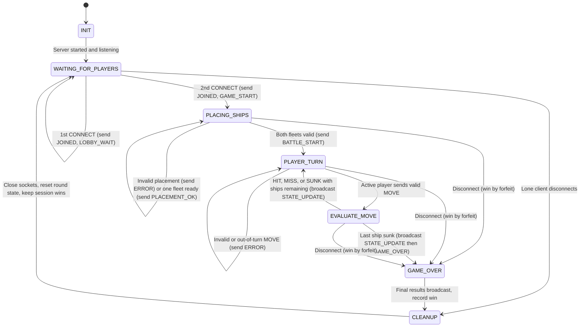

# Game State Machine (v2)

```mermaid
stateDiagram-v2
    [*] --> INIT
    INIT --> WAITING_FOR_PLAYERS : Server started and listening
    WAITING_FOR_PLAYERS --> WAITING_FOR_PLAYERS : 1st CONNECT (send JOINED, LOBBY_WAIT)
    WAITING_FOR_PLAYERS --> PLACING_SHIPS : 2nd CONNECT (send JOINED, GAME_START)
    WAITING_FOR_PLAYERS --> CLEANUP : Lone client disconnects

    PLACING_SHIPS --> PLACING_SHIPS : Invalid placement (send ERROR) or one fleet ready (send PLACEMENT_OK)
    PLACING_SHIPS --> PLAYER_TURN : Both fleets valid (send BATTLE_START)
    PLACING_SHIPS --> GAME_OVER : Disconnect (win by forfeit)

    PLAYER_TURN --> EVALUATE_MOVE : Active player sends valid MOVE
    PLAYER_TURN --> PLAYER_TURN : Invalid or out-of-turn MOVE (send ERROR)
    PLAYER_TURN --> GAME_OVER : Disconnect (win by forfeit)

    EVALUATE_MOVE --> PLAYER_TURN : HIT, MISS, or SUNK with ships remaining (broadcast STATE_UPDATE)
    EVALUATE_MOVE --> GAME_OVER : Last ship sunk (broadcast STATE_UPDATE then GAME_OVER)
    EVALUATE_MOVE --> GAME_OVER : Disconnect (win by forfeit)

    GAME_OVER --> CLEANUP : Final results broadcast, record win
    CLEANUP --> WAITING_FOR_PLAYERS : Close sockets, reset round state, keep session wins
```
